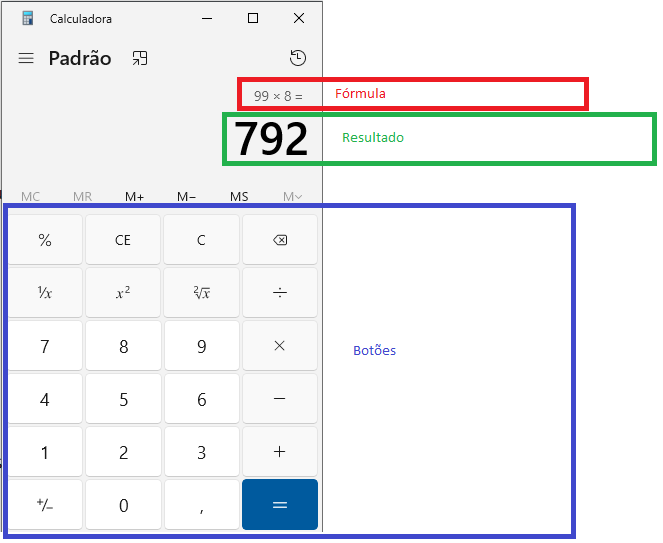

# Exercício para entrega

- Data de entrega: 13/03/2025 até às 22h
- Entregar o que tiver feito
- Vale 0,5 na média

- Utilizando HTML e JavaScript (puro), construa uma calculadora
- Sua calculadora deverá possuir:
   - Números de 0 à 9
   - Operadores - * / +
   - Totalizador ( = )
   - Área de fórmula
   - Área de resultado
   - Utilize como base a calculadora do Windows

- **IMPORTANTE**: cada botão deve chamar a mesma função JavaScript (exemplo Aula04)
 
```js
 //Comando eval é utilizado para calcular o valor de uma string

 var formula = "5+8*9+7-96"
 var resultado = eval( formula )
 console.log( resultado )

 // -12
```


